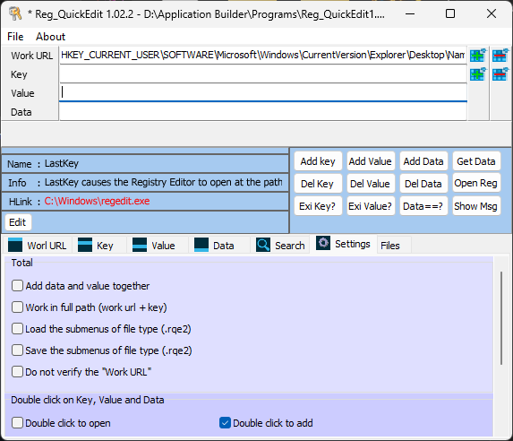
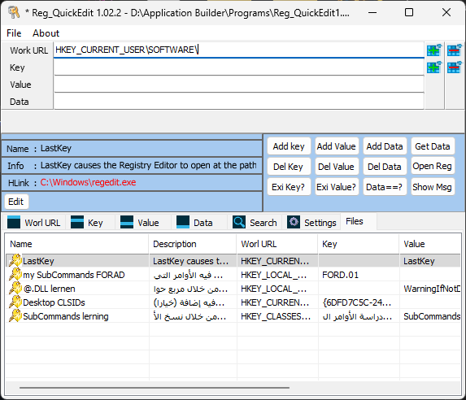
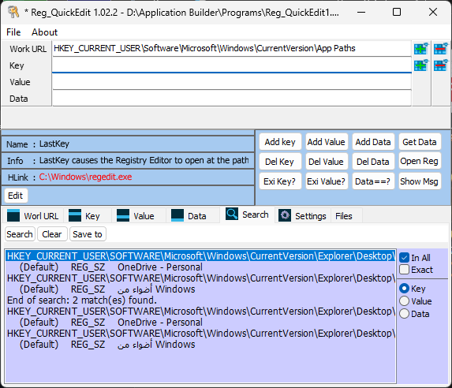
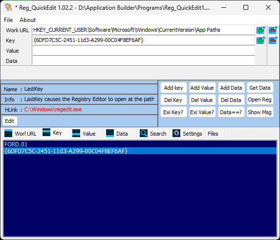
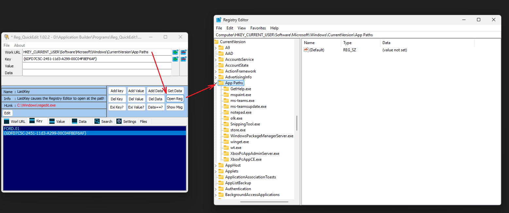

# Reg_QuickEdit

Reg_QuickEdit is a personal Windows utility developed with Longtion Application Builder to improve productivity when working with the Windows Registry.

The project was designed to reduce the repetitive work required when navigating Registry paths, editing keys and values, searching for information, and performing registry-related tasks. Instead of manually entering long registry paths and repeatedly switching between locations, users can save, organize, restore, and quickly access their work environment.

## Main Purpose

The application was created to:

* Speed up Registry navigation and editing
* Reduce repetitive manual input of registry paths, keys, values, and data
* Preserve the current work context while performing searches
* Organize frequently used Registry locations
* Improve productivity during Registry research and Windows customization tasks

## Features

* Browse Windows Registry keys, values, and data
* Search for registry entries without disrupting the current work path
* Add and delete keys
* Add and delete values
* Read registry data
* Open Registry Editor directly at selected registry locations
* Save and restore complete work sessions
* Store frequently used registry paths and entries
* Manage custom workspace files (.rqe2)
* Export and import saved sessions
* Open multiple instances of the application simultaneously for working on different Registry locations
* Execute helper commands through Windows Shell and CMD integration
* Launch Registry-related dialogs and Windows components directly from saved entries
* Simplify exploration of CLSIDs and Shell-related Registry entries
* Assist in Registry research and Windows system analysis

## Technologies

* Longtion Application Builder
* Windows Registry
* Windows Shell
* Windows CMD
* Batch Scripts (.bat)

## Project Purpose

This project was created as a personal learning project to gain practical experience in:

* Application design
* User interface development
* Windows Registry internals
* Session and workspace management
* Windows automation
* CMD and Shell integration

## Project Status

Personal learning project.

## Screenshots

### Main Interface

### Registry Navigation

### Registry Search

### Saved Registry Locations

### Open Registry Path

